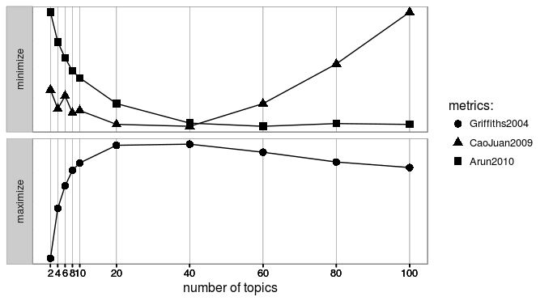

```{r setup, include=FALSE}
knitr::opts_chunk$set(
	echo = FALSE,
	message = FALSE,
	warning = FALSE,
	cache = TRUE,
	collapse = TRUE,
	comment = "#>"
)
```

```{r load packages, cache=FALSE, include=FALSE}
library(magrittr)
library(data.table)
library(dplyr)
library(dtplyr)
library(readr)
library(stringr)
library(tm) # install.packages("slam", type = "binary")
library(text2vec)
library(jiebaR) # word segmentation
library(wordcloud2)
# library(topicmodels)
# http://stackoverflow.com/questions/24172188/how-can-i-install-topicmodels-package-in-r
library(ldatuning) # Select number of topics for LDA model # sudo apt install libmpfr-dev
library(wordVectors) # devtools::install_github("bmschmidt/wordVectors")
library(lda)
library(LDAvis)
library(ggplot2)
library(feather)
library(DT)
library(corrr) # for corr plot
library(Matrix) # for Sparse Matrix
library(slam)
lapply(list.files("utils", pattern = "\\.[Rr]$", full.names = TRUE), 
       FUN = function(x) {source(x, encoding = "UTF-8"); return()})
# devtools::install_github("qinwf/ropencc") # 繁簡轉換
```


## Data Source

```{r, include=FALSE}
post_dt <- read_feather("data/fb_aboutkeelung_post.feather") %>% 
  data.table()
comment_dt <- read_feather("data/fb_aboutkeelung_comments.feather") %>% 
  data.table()
share_dt <- read_feather("data/fb_aboutkeelung_shares.feather") %>% 
  data.table()
```

```{r, include=FALSE}
## Data cleansing

# remove emoji
post_dt[, message := message %>% str_replace_all("\\p{So}|\\p{Cn}", "")]
comment_dt[, message := message %>% str_replace_all("\\p{So}|\\p{Cn}", "")]
# remove url
url_re <- "(https?|ftp)://[^\\s/$.?#].[^\\s]"
post_dt[, message := message %>% str_replace_all(url_re, "")]
comment_dt[, message := message %>% str_replace_all(url_re, "")]
# remove empty string
comment_dt <- comment_dt[message != ""]
```

- 來源：基隆人踹共
- 期間：`r min(post_dt$created_date)` - `r max(post_dt$created_date)`

### 變數

- Post

```{r}
names(post_dt)
all_dt <- merge(
  post_dt[, .(id, link, message, created_date)], 
  comment_dt[, .(post_id, message, created_time)],
  by.x="id", by.y="post_id", all.x = TRUE)
temp <- all_dt[, .(comment_message = paste(message.y, collapse = "\n>>> ")), by = id]
all_dt <- temp[post_dt, on = c("id")]
# all_dt[, .(message, 
#            comment_message,
#            created_date = add_text_url(created_date, link))] %>% 
#   DT::datatable(escape = FALSE, options = list(searchHighlight = TRUE))
```

- Comments

```{r}
names(comment_dt)
```

- Share

```{r}
names(share_dt)
```

--------------------------------------------------

## 貼文聲量分析

### 按讚、分享、回文數量之相關性

針對每則貼文，計算兩兩按讚、分享、回文的相關係數，
按讚數，與回文數及分享數的相關係數分別為 .52, .43，若只以按讚數來看聲量大小，也具有一定的代表性。

```{r}
d <- post_dt[, .(likes_count, shares_count, comments_count)] %>% 
  correlate %>% 
  shave()
  # shave(upper = FALSE) %>%
d
d %>% rplot(print_cor = TRUE) 
```


### 按讚

- 按讚聲量分佈

按讚聲量的分佈呈右尾分佈（right skewed），中位數為 67，因此只取前面幾名的貼文作為議題擴散程度較大的代表來分析。

```{r}
d <- post_dt[order(-likes_count), .(likes_count)]
p <- ggplot(d, aes(likes_count)) + 
  geom_histogram(color = "white", binwidth = 50) +
  scale_x_continuous(minor_breaks = seq(0, 3000, 50)) +
  ylab("# of post")
post_dt[, likes_count] %>% summary()
plot(p)
```

- 按讚聲量排行榜 Top 10

```{r}
d <- post_dt[order(-likes_count)][
  1:10, .(message, likes_count, 
          created_date = add_text_url(created_date, link))] 
DT::datatable(d, escape = FALSE, options = list(searchHighlight = TRUE))
```

1. 公車司機
2. 李鵠餅店回收正義香油製品
3. 北北基因為颱風假放半天遭網友罵翻
4. 大船入港照（郵輪）
5. 公車司機
6. 貼心里長
7. 淨灘新聞
8. 台北市國光客運西站部分，調整到南港轉運站爭議
9. 滅頂
10. 客運擬改停南港 基隆人反彈

> 交通問題是重點


### 分享

- 分享聲量分佈

```{r}
d <- post_dt[order(-shares_count), .(shares_count)]
post_dt[, shares_count] %>% summary()
ggplot(d, aes(shares_count)) + 
  geom_histogram(color = "white", binwidth = 50) +
  scale_x_continuous(minor_breaks = seq(1, 1000, 50)) +
  ylab("# of post")
```

- 分享聲量排行榜 Top 10

```{r}
d <- post_dt[order(-shares_count)][
  1:10, .(message, shares_count, 
          created_date = sprintf("<a href='%s' target='_blank'>%s</a>", 
                                 link, created_date))]
DT::datatable(d, escape = FALSE, options = list(searchHighlight = TRUE))
```

### 回文

- 回文聲量排行榜

```{r}
d <- post_dt[order(-comments_count), .(comments_count)]
ggplot(d, aes(comments_count)) + 
  geom_histogram(color = "white", bins = 50) +
  scale_x_continuous(minor_breaks = seq(1, 5000, 10)) +
  ylab("# of post")
```

- 回文聲量排行榜 Top 10

回文較多的文章，很多是引起憤怒鄉民的話題

```{r}
d <- post_dt[order(-comments_count)][
  1:10, .(message, comments_count, 
          created_date = sprintf("<a href='%s' target='_blank'>%s</a>", 
                                 link, created_date))]
DT::datatable(d, escape = FALSE, options = list(searchHighlight = TRUE))
```


## 文字探勘

```{r tm functions, cache=FALSE, include=FALSE}
## 起手式，結巴建立斷詞器
mix_seg <- worker(type = "mix",
                  user = "utils/dict_utf8.txt",
                  stop_word = "utils/stop_utf8.txt",
                  symbol = FALSE,
                  encoding = "UTF-8")
hmm_seg <- worker(type = "hmm",
                  user = "utils/dict_utf8.txt",
                  stop_word = "utils/stop_utf8.txt",
                  symbol = FALSE,
                  encoding = "UTF-8")
# mix_seg <= post_text[1] # try first post

# self-made filter (built-in perl's regular expression has bug)
cutter <- function (text, worker = mix_seg) {
  # text = "馬英九去世新大學演講"
  if (text %in% c(".", "")) {
    return(NA_character_)
  }
  
  filter_words = c(
    "食(品)?安(全)?","食品",
    "英文$","年\\n","媒\\n",
    "我.?","他.?","你.?",
    "所以","可以","沒有","不過","因為",
    "還是","覺得","大家","比較","感覺","時候","現在","時間",
    "可能","東西","然後","而且","自己","有點",
    "這邊","那.","發現","雖然","不要","還是",
    "一樣","知道","看到","真的","今天","就是","這樣","如果",
    "不會","什麼","後來","問題","之前","只是","或是","的話",
    "其他","這麼","已經","很多","出來","整個","但是","卻",
    "偏偏","如果","不過","因此","或","又","也","其實",
    "希望","結果","怎麼","當然","有些","以上","另外","此外",
    "以外","裡面","部分","直接","剛好","由於",
    "原本","標題","時間","日期","作者","這種","表示","看見",
    "似乎","一半","一堆","反正","常常","幾個","目前","上次",
    "公告","只好","哪裡","一.","怎麼","好像","結果",
    "而已", "居然", "謝謝",
    "po","xd","應該","最後","有沒有","sent","from","my",
    "Android", "JPTT",
    "記者",
    "中心","之.","指出","朋友",
    "了","也","的","在","與","及","等","是","the","and",
    "月", "年", "日", "時", "NA",
    "com",
    "\\s",
    "[a-zA-Z]",
    "[0-9]"
  )
  pattern <- sprintf("^%s", paste(filter_words, collapse = "|^"))
  tryCatch({
    text_seg <- worker <= text
  }, error = function(e) {
    stop('"', text, '" >> ', e)
  })
  filter_seg <- text_seg[!stringr::str_detect(text_seg, pattern)]
  filter_seg
}
```

### 貼文

- 關鍵詞 Top 100

利用 tf-idf 關鍵詞算法，處理高頻詞高估及低頻詞低估的問題，取得整個文檔的關鍵詞

```{r, include=FALSE}
# segment
post_text_seg <- all_dt[, comment_message] %>% 
  lapply(cutter, worker = mix_seg) %>% 
  lapply(function(x) x[!is.na(x)])
# adjust to the format for text2vec::itoken
post_text_token <- itoken(post_text_seg)
```

```{r, include=FALSE}
# unique word matrix
vocab <- create_vocabulary(post_text_token, ngram=c(1, 1))
# dtm
vectorizer <- vocab_vectorizer(vocab)
dtm <- create_dtm(post_text_token, vectorizer)
# remove 1-word term
dtm <- dtm[, dtm %>% colnames() %>% nchar >= 2]

# dtm %>% find_freq_terms(30) # not good

## tf-idf
# define tfidf model
tfidf = TfIdf$new()
# fit model to train data and transform train data with fitted model
dtm_train_tfidf = fit_transform(dtm, tfidf)
# tfidf modified by fit_transform() call!
```

```{r}
key_term <- dtm_train_tfidf %>% find_freq_terms(3) %>% 
  colSums %>% 
  data.frame() %>% 
  data.table(keep.rownames = TRUE) %>% 
  setnames(c("keyword", "sum_tf_idf")) %>% 
  .[order(-sum_tf_idf)]
key_term %>% head(100) %>% DT::datatable()
```

- Wordcloud

```{r, cache=FALSE}
d <- key_term %>% head(100)
ncolor <- nrow(d)
getPalette = colorRampPalette(RColorBrewer::brewer.pal(8, "Set2"))
wordcloud2(d, 
           size = 0.75,
           fontFamily = "Noto Sans CJK TC", 
           fontWeight = "normal",
           rotateRatio = 0,
           color = getPalette(ncolor),
           shape = "circle")
```


### 回文

- 關鍵詞 Top 100

```{r, include=FALSE}
# tokenize and output as a list:
# doc_list <- all_dt[, comment_message] %>% 
doc_list <- comment_dt[, message] %>% 
  lapply(cutter, worker = mix_seg) %>% 
  lapply(function(x) x[!is.na(x)])
# adjust to the format for text2vec::itoken
text_token <- itoken(doc_list)
```

```{r, include=FALSE}
# unique word matrix
vocab_tbl <- create_vocabulary(text_token, ngram=c(1, 1))

# dtm
vectorizer <- vocab_vectorizer(vocab_tbl)
dtm <- create_dtm(text_token, vectorizer)

# remove 1-word term
dtm <- dtm[, dtm %>% colnames() %>% nchar >= 2]
# dtm %>% find_freq_terms(30) # not good

## tf-idf
# define tfidf model
tfidf = TfIdf$new()
# fit model to train data and transform train data with fitted model
dtm_train_tfidf = fit_transform(dtm, tfidf)
# tfidf modified by fit_transform() call!
```

```{r}
key_term <- dtm_train_tfidf %>% find_freq_terms(3) %>% 
  colSums %>% 
  data.frame() %>% 
  data.table(keep.rownames = TRUE) %>% 
  setnames(c("keyword", "sum_tf_idf")) %>% 
  .[order(-sum_tf_idf)]

key_term %>% head(100) %>% DT::datatable()
```

- Wordcloud

```{r}
d <- key_term %>% head(100)
ncolor <- nrow(d)
getPalette = colorRampPalette(RColorBrewer::brewer.pal(8, "Set2"))
wordcloud2(d, 
           size = 0.9,
           fontFamily = "Noto Sans CJK TC", 
           fontWeight = "normal",
           rotateRatio = 0,
           color = getPalette(ncolor))
```

- Topic Models

```{r, eval=FALSE}
# Preprocessing ------------------------------------------------

doc.list <- all_dt[, comment_message] %>% 
  lapply(cutter, worker = mix_seg) %>% 
  lapply(function(x) x[!is.na(x)]) 
dtm <- doc.list %>% seglist_to_dtm %>% filter_tfidf_dtm

# compute the table of terms:
term.table <- dtm %>% slam::col_sums()
term.table <- sort(term.table, decreasing = TRUE)

# remove terms that are stop words or occur fewer than 5 times:
del <- term.table < 5
term.table <- term.table[!del]
vocab <- names(term.table)

get_terms <- function(doc.list, vocab) {
  index <- match(doc.list, vocab)
  index <- index[!is.na(index)]
  rbind(as.integer(index - 1), as.integer(rep(1, length(index))))
}
documents <- lapply(doc.list, get_terms, vocab=vocab)

# Compute some statistics related to the data set:
D <- length(documents)  # number of documents (2,000)
W <- length(vocab)  # number of terms in the vocab (14,568)
doc.length <- sapply(documents, function(x) sum(x[2, ]))  # number of tokens per document [312, 288, 170, 436, 291, ...]
N <- sum(doc.length)  # total number of tokens in the data (546,827)
term.frequency <- as.integer(term.table)  # frequencies of terms in the corpus

# 跑個模擬，挑一個好的主題數 -----------------------------------

# https://cran.r-project.org/web/packages/ldatuning/vignettes/topics.html
tic <- Sys.time()
result <- FindTopicsNumber(
  dtm,
  topics = c(seq(2, 6, by = 2),
             seq(10, 60, by = 5),
             seq(60, 100, by = 20)#,
             # seq(120, 200, by = 20)
             ),
  metrics = c("Griffiths2004", "CaoJuan2009", "Arun2010"),
  method = "Gibbs",
  control = list(seed = 77),
  mc.cores = 3L,
  verbose = TRUE
)
Sys.time() - tic
FindTopicsNumber_plot(result)
```



```{r, eval=FALSE}
# Topic Model ----------------------------------

# vocab_temp <- dtm_train_tfidf %>% filter_tfidf_dtm() %>% colnames()
# term.table <- vocab_tbl$vocab %>% 
#   data.table() %>% 
#   .[terms %in% vocab_temp && terms >= 2]
# term.frequency <- term.table[, terms_counts]
# vocab <- term.table[, terms]


# MCMC and model tuning parameters:
K <- 40  # n_topic
G <- 3000 # num.iterations
alpha <- 0.02
eta <- 0.02

# Fit the model:
set.seed(357)
t1 <- Sys.time()
lda_fit <- lda.collapsed.gibbs.sampler(
  documents = documents, K = K, vocab = vocab, 
  num.iterations = G, alpha = alpha, 
  eta = eta, initial = NULL, burnin = 0,
  compute.log.likelihood = TRUE)
t2 <- Sys.time()
t2 - t1  # about 2.899927 mins on server

# Save Result
save(lda_fit, file = "./models/fb_comments_lda_fit.RData")
```

根據指標選擇 40 個 topic cluster

**Result**

```{r, cache=FALSE}
library(lda)
load("./models/fb_comments_lda_fit.RData")
# Top topic result
top_docs_num <- lda_fit$document_sums %>% top.topic.documents(5)
top_words <- lda_fit$topics %>% top.topic.words(num.words = 5, by.score = TRUE) %>% 
  data.frame() %>% data.table()

top_words %>% DT::datatable()
```

### [Quick View](https://leoluyi.github.io/keelung_city_image/fb_kl_ldavis/)

```{r, eval=FALSE}
theta <- t(apply(lda_fit$document_sums + alpha, 2, function(x) x/sum(x)))
phi <- t(apply(t(lda_fit$topics) + eta, 2, function(x) x/sum(x)))

list(phi = phi,
     theta = theta,
     doc.length = doc.length,
     vocab = vocab,
     term.frequency = term.frequency)

lda_view <- list(phi = phi,
                 theta = theta,
                 doc.length = doc.length,
                 vocab = vocab,
                 term.frequency = term.frequency)

# create the JSON object to feed the visualization:
json <- createJSON(phi = lda_view$phi, 
                   theta = lda_view$theta, 
                   doc.length = lda_view$doc.length, 
                   vocab = lda_view$vocab, 
                   term.frequency = lda_view$term.frequency)
serVis(json, out.dir = 'fb_kl_ldavis', open.browser = FALSE)
```

## word2vec

```{r, eval=FALSE, include=FALSE}
library(wordVectors)

# Prepare tokenizes text file
all_text <- all_dt[, paste(comment_message, message, sep = "\n")]
all_text_split <- all_text %>%
  lapply(cutter, worker = mix_seg) %>% 
  lapply(function(x) x[!is.na(x)]) %>% 
  sapply(paste, collapse = " ")
all_text_split %>% write_lines("data/tokenized/fb_split.txt")

# Fit models
tic <- Sys.time()
vector_set <- train_word2vec(train_file = "data/tokenized/fb_split.txt",
                          output_file = "models/fb_keelung_word2vec.bin",
                          force = TRUE,
                          vectors = 100,
                          threads = parallel::detectCores()-1,
                          window = 12)
print(Sys.time() - tic)
```

```{r, include=FALSE}
library(wordVectors)
vector_set <- read.vectors("models/fb_keelung_word2vec.bin")
```


### 相近關聯詞

- 景點

```{r}
nearest_to(vector_set, vector_set[["景點"]], n = 20)
```

- 停車

```{r}
nearest_to(vector_set, vector_set[["停車"]], n = 20)
```

- 交通

```{r}
nearest_to(vector_set, vector_set[["交通"]], n = 20)
```

### 向量 (根據文字向量距離由小至大排列)

- 遊客：夜市= 本地人：？

```{r}
nearest_to(vector_set,
vector_set[["遊客"]] - vector_set[["夜市"]] + vector_set[["本地人"]],
n = 10)
```


- 基隆：市長 = 台北 : ?

```{r}
nearest_to(vector_set,
vector_set[["基隆"]] - vector_set[["市長"]] + vector_set[["台北"]],
n = 10)
```

- 基隆：海洋廣場 = 台北 : ?

```{r}
nearest_to(vector_set,
vector_set[["基隆"]] - vector_set[["海洋廣場"]] + vector_set[["台北"]],
n = 10)
```

－ 基隆：交通=台北:?

```{r}
nearest_to(vector_set,
vector_set[["基隆"]] - vector_set[["交通"]] + vector_set[["台北"]],
n = 10)
```

- 基隆：交通=新北市:?

```{r}
nearest_to(vector_set,
vector_set[["基隆"]] - vector_set[["交通"]] + vector_set[["新北市"]],
n = 10)
```

- 基隆：河 = 台北:？

```{r}
nearest_to(vector_set,
vector_set[["基隆"]] - vector_set[["河"]] + vector_set[["台北"]],
n = 10)
```

----------------------------------------------------

### Bag of Words

碎片化的單詞構成句子，再構成文本


## Reference

- [Exploring GloVe Word Vectors in R](https://rpubs.com/ww44ss/wordvectors)
- [tf-idf](http://www.ruanyifeng.com/blog/2013/03/tf-idf.html)
- [文字探勘（Text Mining)](http://www.ithome.com.tw/voice/90361)
- [LDA](http://cpsievert.github.io/LDAvis/reviews/reviews.html)

> 文字探勘（Text Mining）被視為是資料探勘（Data Mining）的一環，其中有個關鍵的差別，在於傳統資料探勘所處理的資料，都是「結構性」的資料，也就是說，資料本身具有明確的結構，例如，像是一個固定結構的表格，每個欄位有其明確的定義及值。而資料探勘技術中的演算法，則是以這些結構性的資料為輸入，經過演算過程之後計算得到結果。但文字探勘不同於資料探勘的地方，則在於它的原始輸入資料，都是沒有特定結構的純文字，這些文字的內容，都是用人類的自然語言所寫成的，所以，無法直接套用資料探勘的演算法，來計算出些什麼有意義的東西。
> 
> 在我們生活當中，除了具結構性的資料，也有相當大量的文字資料，像是每天的新聞、人們在 Facebook、Twitter、微博上所發表的近況更新、部落格文章、專利文件等等。這些自然語言文字型的資料中，同樣蘊藏可觀、極具潛力的「礦產」，也就是有價值的資訊，等著我們用資訊技術去開採。這就是文字探勘技術及應用所希望達成的目標。


