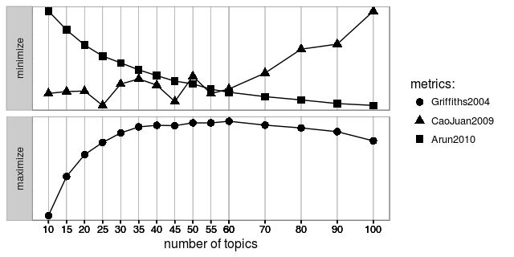

```{r setup, include=FALSE}
knitr::opts_chunk$set(
	echo = FALSE,
	message = FALSE,
	warning = FALSE,
	cache = TRUE,
	collapse = TRUE,
	fig.align = "center",
	fig.width = 8,
	comment = "#>"
)
```

```{r, cache=FALSE, include=FALSE}
library(magrittr)
library(data.table)
library(dplyr)
library(dtplyr)
library(readr)
library(stringr)
library(tm) # install.packages("slam", type = "binary")
library(text2vec)
library(jiebaR) # word segmentation
library(wordcloud2)
# library(topicmodels)
# http://stackoverflow.com/questions/24172188/how-can-i-install-topicmodels-package-in-r
library(ldatuning) # Select number of topics for LDA model # sudo apt install libmpfr-dev
library(wordVectors) # devtools::install_github("bmschmidt/wordVectors")
library(ggplot2)
library(feather)
library(DT)
library(corrr) # for corr plot
library(Matrix) # for Sparse Matrix
library(slam)
library(lubridate)
library(viridis)
lapply(list.files("utils", pattern = "\\.[Rr]$", full.names = TRUE), 
       FUN = function(x) {source(x, encoding = "UTF-8"); return()})
# devtools::install_github("qinwf/ropencc") # 繁簡轉換
```

## Data Source

```{r, include=FALSE, cache=TRUE}
ptt_dt <- read_feather("data/ptt_kl_data.feather") %>% data.table

# # Data Cleansing
ptt_dt[, `:=`(post_time = post_time %>%
         strptime("%a %b %d %T %Y", tz = "ROC") %>% as.POSIXct)]
ptt_dt[, `:=`(post_time = ifelse(post_time>=as.POSIXct("1990-01-01","CST") %>% 
                                   as.numeric(),
                                 post_time,
                                 NA))]
ptt_dt[, `:=`(post_time = post_time %>% 
                 as.POSIXct(tz = "CST", origin = "1970-01-01"))]
ptt_dt[, category := 
         stringr::str_extract(title, "^\\[([^]]+?)\\]")]
```

- 來源：PTT Keeling 板
- 期間：`r min(ptt_dt$post_time, na.rm=T)` - `r max(ptt_dt$post_time, na.rm=T)`
- 文本數量：`r nrow(ptt_dt)` 篇文章

## 文章標題分析

### 文章種類 Top 20

```{r}
ptt_dt[!is.na(category), .N, by = .(category)][order(-N)] %>% head(20)
```

### PTT Keelung 發文種類分佈

```{r}
top20 <- ptt_dt[!is.na(category), .N, by = .(category)][order(-N)] %>% head(20)
d <- ptt_dt[category %in% top20$category, .(category, post_time)][
  , category := factor(category, levels = top20$category)][
    , post_date := as.Date(post_time)]
ggplot(d, aes(x = post_date, color = category, fill = category)) +
  stat_density(geom = "area", alpha = 0.2) +
  # stat_bin(binwidth = 30, geom = "area", alpha = 0.2) +
  # scale_color_brewer(palette = "Set2") +
  # scale_fill_brewer(palette = "Set2") +
  ggtitle("PTT Keelung 發文種類分佈") +
  guides(color = guide_legend(title = NULL, label.position = "top", 
                              nrow=2, byrow = TRUE),
         fill = FALSE) +
  facet_wrap(~ category, ncol = 5) +
  theme_bw() +
  theme(legend.position="none", text = element_text(family = "STHeiti", 
                                                    size = 14))
```

## Text Mining

```{r tm functions, include=FALSE}
## 起手式，結巴建立斷詞器
mix_seg <- worker(type = "mix",
                  user = "utils/dict_utf8.txt",
                  stop_word = "utils/stop_utf8.txt",
                  symbol = FALSE,
                  encoding = "UTF-8")
hmm_seg <- worker(type = "hmm",
                  user = "utils/dict_utf8.txt",
                  stop_word = "utils/stop_utf8.txt",
                  symbol = FALSE,
                  encoding = "UTF-8")
# mix_seg <= post_text[1] # try first post

# self-made filter (built-in perl's regular expression has bug)
cutter <- function (text, worker = mix_seg) {
  # text = "馬英九去世新大學演講"
  if (text %in% c(".", "")) {
    return(NA_character_)
  }
  
  filter_words = c(
    "食(品)?安(全)?","食品",
    "英文$","年\\n","媒\\n",
    "我.?","他.?","你.?",
    "所以","可以","沒有","不過","因為",
    "還是","覺得","大家","比較","感覺","時候","現在","時間",
    "可能","東西","然後","而且","自己","有點",
    "這邊","那.","發現","雖然","不要","還是",
    "一樣","知道","看到","真的","今天","就是","這樣","如果",
    "不會","什麼","後來","問題","之前","只是","或是","的話",
    "其他","這麼","已經","很多","出來","整個","但是","卻",
    "偏偏","如果","不過","因此","或","又","也","其實",
    "希望","結果","怎麼","當然","有些","以上","另外","此外",
    "以外","裡面","部分","直接","剛好","由於",
    "原本","標題","時間","日期","作者","這種","表示","看見",
    "似乎","一半","一堆","反正","常常","幾個","目前","上次",
    "公告","只好","哪裡","一.","怎麼","好像","結果",
    "而已", "居然", "謝謝","請問","大大","小弟", "文章代碼",
    "po","xd","應該","最後","有沒有","sent","from","my",
    "Android", "JPTT", "如提","如題","編輯","引述","銘言","站內信",
    "記者",
    "中心","之.","指出","朋友",
    "了","也","的","在","與","及","等","是","the","and",
    "月", "年", "日", "時", "NA",
    "com",
    "\\s",
    "[a-zA-Z]",
    "[0-9]"
  )
  pattern <- sprintf("^%s", paste(filter_words, collapse = "|^"))
  tryCatch({
    text_seg <- worker <= text
  }, error = function(e) {
    stop('"', text, '" >> ', e)
  })
  filter_seg <- text_seg[!stringr::str_detect(text_seg, pattern)]
  filter_seg
}
```

- 關鍵詞 Top 100

1. 排除 `r c("[交易]", "[徵求]", "[贈送]", "[公告]", "[協尋]", "[自介]")` 類別文章
2. 利用 tf-idf 關鍵詞算法，處理高頻詞高估及低頻詞低估的問題，取得整個文檔的關鍵詞

```{r, include=FALSE}
# segment
library(parallel)
post_text_seg <- ptt_dt[
  !category %in% c("[交易]", "[徵求]", "[贈送]", "[公告]", "[協尋]", "[自介]")
  , post_text] %>% 
  mclapply(cutter, worker = mix_seg, mc.cores = 3) %>% 
  mclapply(function(x) x[!is.na(x)], mc.cores = 3)
# adjust to the format for text2vec::itoken
post_text_token <- itoken(post_text_seg)
```

```{r, include=FALSE}
# unique word matrix
vocab <- create_vocabulary(post_text_token, ngram=c(1L, 2L))
# dtm
vectorizer <- vocab_vectorizer(vocab)
dtm <- create_dtm(post_text_token, vectorizer)
# remove 1-word term
dtm <- dtm[, dtm %>% colnames() %>% nchar >= 2]

# dtm %>% find_freq_terms(30) # not good

## tf-idf
# define tfidf model
tfidf = TfIdf$new()
# fit model to train data and transform train data with fitted model
dtm_train_tfidf = fit_transform(dtm, tfidf)
# tfidf modified by fit_transform() call!
```

```{r}
key_term <- dtm_train_tfidf %>% find_freq_terms(3) %>% 
  colSums() %>% 
  data.frame() %>% 
  data.table(keep.rownames = TRUE) %>% 
  setnames(c("keyword", "sum_tf_idf")) %>% 
  .[order(-sum_tf_idf)]
key_term %>% head(100) %>% DT::datatable()
```

- Wordcloud

```{r}
d <- key_term %>% head(200)
ncolor <- nrow(d)
getPalette = colorRampPalette(RColorBrewer::brewer.pal(8, "Set2"))
wordcloud2(d, 
           size = 0.5,
           fontFamily = "Noto Sans CJK TC", 
           fontWeight = "normal",
           rotateRatio = 0,
           color = getPalette(ncolor),
           shape = "circle")
```

### Topic Models

```{r, eval=FALSE}
# Preprocessing ------------------------------------------------

doc.list <- post_text_seg

## tf-idf
# define tfidf model
tfidf = TfIdf$new()
# fit model to train data and transform train data with fitted model
dtm_train_tfidf = fit_transform(dtm, tfidf)
# tfidf modified by fit_transform() call!

l1 <- dtm_train_tfidf %>% find_freq_terms(lowfreq = 5) %>% 
  colSums() %>% median()
l1_terms <- (dtm_train_tfidf %>% find_freq_terms(lowfreq = 5) %>% 
  colSums() > l1) %>% names

# compute the table of terms:
# term.table <- dtm %>% slam::col_sums()
# term.table <- sort(term.table, decreasing = TRUE)
term.table <- setNames(vocab$vocab$terms_counts, vocab$vocab$terms)
del <- term.table < 5
term.table <- term.table[!del]
vocab_ <- names(term.table)

# remove terms that are stop words or occur fewer than 5 times:
# del <- term.table < 5
# term.table <- term.table[!del]
# vocab <- names(term.table)

get_terms <- function(doc.list, vocab) {
  index <- match(doc.list, vocab)
  index <- index[!is.na(index)]
  rbind(as.integer(index - 1), as.integer(rep(1, length(index))))
}
documents <- mclapply(doc.list, get_terms, vocab=vocab_, mc.cores = 3)

# Compute some statistics related to the data set:
D <- length(documents)  # number of documents (2,000)
W <- length(vocab_)  # number of terms in the vocab (14,568)
doc.length <- sapply(documents, function(x) sum(x[2, ]))  # number of tokens per document [312, 288, 170, 436, 291, ...]
N <- sum(doc.length)  # total number of tokens in the data (546,827)
term.frequency <- as.integer(term.table)  # frequencies of terms in the corpus
```

```{r, eval=FALSE}
# 跑個模擬，挑一個好的主題數 -----------------------------------

doc.list <- ptt_dt[, post_text] %>% 
  mclapply(cutter, worker = mix_seg, mc.cores = 3) %>% 
  mclapply(function(x) x[!is.na(x)], mc.cores = 3) 
dtm <- doc.list %>% seglist_to_dtm %>% filter_tfidf_dtm

# https://cran.r-project.org/web/packages/ldatuning/vignettes/topics.html
tic <- Sys.time()
result <- FindTopicsNumber(
  dtm,
  topics = c(#seq(2, 6, by = 2),
             seq(10, 60, by = 5),
             seq(60, 100, by = 10)#,
             # seq(120, 200, by = 20)
             ),
  metrics = c("Griffiths2004", "CaoJuan2009", "Arun2010"),
  method = "Gibbs",
  control = list(seed = Sys.time() %>% as.numeric()),
  mc.cores = 3L,
  verbose = TRUE
)
Sys.time() - tic
save(result, file = "models/ptt_kl_simmulation.RData")
FindTopicsNumber_plot(result)
```



```{r, eval=FALSE}
# Topic Model ----------------------------------

# vocab_temp <- dtm_train_tfidf %>% filter_tfidf_dtm() %>% colnames()
# term.table <- vocab_tbl$vocab %>% 
#   data.table() %>% 
#   .[terms %in% vocab_temp && terms >= 2]
# term.frequency <- term.table[, terms_counts]
# vocab <- term.table[, terms]


# MCMC and model tuning parameters:
K <- 55  # n_topic
G <- 3000 # num.iterations
alpha <- 0.02
eta <- 0.02

# Fit the model:
set.seed(2016)
t1 <- Sys.time()
lda_fit <- lda.collapsed.gibbs.sampler(
  documents = documents, K = K, vocab = vocab_, 
  num.iterations = G, alpha = alpha, 
  eta = eta, initial = NULL, burnin = 0,
  compute.log.likelihood = TRUE)
t2 <- Sys.time()
t2 - t1  # about 2.899927 mins on server

# Save Result
# save(lda_fit, file = "./models/ptt_keelung_lda_fit.RData")
```

根據指標選擇 55 個 topic cluster

**Result**

```{r topic models result, cache=FALSE}
library(lda)
load("./models/ptt_keelung_lda_fit.RData")
# Top topic result
top_docs_num <- lda_fit$document_sums %>% top.topic.documents(5)
top_words <- lda_fit$topics %>% top.topic.words(num.words = 6, by.score = TRUE) %>% 
  data.frame() %>% data.table()

top_words %>% DT::datatable()
```

## word2vec

```{r, eval=FALSE}
library(wordVectors)

# Prepare tokenizes text file
ptt_keelung_split <- post_text_seg %>%
  sapply(paste, collapse = " ")
ptt_keelung_split %>% write_lines("data/tokenized/ptt_keelung_split.txt")

# Fit models
tic <- Sys.time()
vector_set <- train_word2vec(train_file = "data/tokenized/ptt_keelung_split.txt",
                          output_file = "models/ptt_keelung_word2vec.bin",
                          force = TRUE,
                          vectors = 100,
                          threads = parallel::detectCores()-1,
                          window = 12)
print(Sys.time() - tic)
```
```{r, include=FALSE}
library(wordVectors)
vector_set <- read.vectors("models/ptt_keelung_word2vec.bin")
```

### 相近關聯詞

- 景點

```{r}
nearest_to(vector_set, vector_set[["景點"]], n = 20)
```

- 停車

```{r}
nearest_to(vector_set, vector_set[["停車"]], n = 20)
```

- 交通

```{r}
nearest_to(vector_set, vector_set[["交通"]], n = 20)
```

- 交通

```{r}
nearest_to(vector_set, vector_set[[c("交通", "動線", "停車")]], n = 20)
```


### 向量 (根據文字向量距離由小至大排列)

- 遊客：夜市= 本地人：？

```{r}
nearest_to(vector_set,
vector_set[["遊客"]] - vector_set[["夜市"]] + vector_set[["本地人"]],
n = 10)
```


- 基隆：市長 = 台北 : ?

```{r}
nearest_to(vector_set,
vector_set[["基隆"]] - vector_set[["市長"]] + vector_set[["台北"]],
n = 10)
```

- 基隆：海洋廣場 = 台北 : ?

```{r}
nearest_to(vector_set,
vector_set[["基隆"]] - vector_set[["海洋廣場"]] + vector_set[["台北"]],
n = 10)
```

－ 基隆：交通=台北:?

```{r}
nearest_to(vector_set,
vector_set[["基隆"]] - vector_set[["交通"]] + vector_set[["台北"]],
n = 10)
```

- 基隆：交通=新北市:?

```{r}
nearest_to(vector_set,
vector_set[["基隆"]] - vector_set[["交通"]] + vector_set[["新北市"]],
n = 10)
```

- 基隆：河 = 台北:？

```{r}
nearest_to(vector_set,
vector_set[["基隆"]] - vector_set[["河"]] + vector_set[["台北"]],
n = 10)
```

## Reference

- [word2vec: Distributed Representations of Words and Phrases
and their Compositionality](https://papers.nips.cc/paper/5021-distributed-representations-of-words-and-phrases-and-their-compositionality.pdf)
- [R package: wordVectors](https://github.com/bmschmidt/wordVectors)
